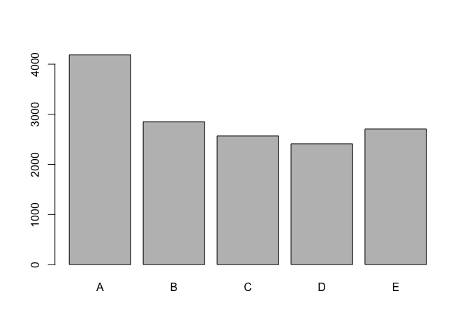
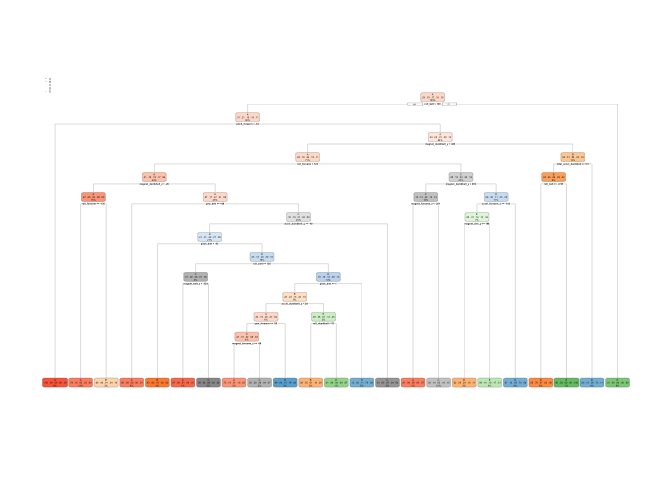

# Practical Machine Learning Project
Peiran Chen  
17/06/2017  

## Background

Using devices such as Jawbone Up, Nike FuelBand, and Fitbit it is now possible to collect a large amount of data about personal activity relatively inexpensively. These type of devices are part of the quantified self movement - a group of enthusiasts who take measurements about themselves regularly to improve their health, to find patterns in their behavior, or because they are tech geeks. One thing that people regularly do is quantify how much of a particular activity they do, but they rarely quantify how well they do it. In this project, your goal will be to use data from accelerometers on the belt, forearm, arm, and dumbell of 6 participants. They were asked to perform barbell lifts correctly and incorrectly in 5 different ways. More information is available from the website here: http://groupware.les.inf.puc-rio.br/har (see the section on the Weight Lifting Exercise Dataset).

## Data

The training data for this project are available here:
https://d396qusza40orc.cloudfront.net/predmachlearn/pml-training.csv

The test data are available here:
https://d396qusza40orc.cloudfront.net/predmachlearn/pml-testing.csv

The data for this project come from this source: http://groupware.les.inf.puc-rio.br/har. 

## Executive Summary
- Load training and testing data
- Subdivide training data for cross validation
- Train data using different model
- Predict on test data

## Load training and testing data

```r
# load required libraries
library(caret)
```

```
## Loading required package: lattice
```

```
## Loading required package: ggplot2
```

```r
library(randomForest)
```

```
## randomForest 4.6-12
```

```
## Type rfNews() to see new features/changes/bug fixes.
```

```
## 
## Attaching package: 'randomForest'
```

```
## The following object is masked from 'package:ggplot2':
## 
##     margin
```

```r
library(rpart)
library(rpart.plot)
# set seed for reproducibility
set.seed(1234)
# load training data and set NAs for missing values
training <- read.csv("/Users/mq20120117/Documents/git-repo/practicalmachinelearning/data/pml-training.csv", na.strings=c("NA","#DIV/0!", ""))
# load testing data and set NAs for missing values
testing <- read.csv("/Users/mq20120117/Documents/git-repo/practicalmachinelearning/data/pml-testing.csv" , na.strings=c("NA","#DIV/0!", ""))

# check str(training) and find many variables are NA. Remove them from data set
# Some variables are not related with our model, such as X, user_name, raw_timestamp_part_1,
# raw_timestamp_part_2, cvtd_timestamp, cvtd_timestamp, new_window and num_window, column 1-7
training <- training[,colSums(is.na(training)) == 0]
training <-training[,-c(1:7)]
testing <- testing[,colSums(is.na(testing)) == 0]
testing <- testing[,-c(1:7)]

# Take a look at our data
dim(training)
```

```
## [1] 19622    53
```

```r
head(training)
```

```
##   roll_belt pitch_belt yaw_belt total_accel_belt gyros_belt_x gyros_belt_y
## 1      1.41       8.07    -94.4                3         0.00         0.00
## 2      1.41       8.07    -94.4                3         0.02         0.00
## 3      1.42       8.07    -94.4                3         0.00         0.00
## 4      1.48       8.05    -94.4                3         0.02         0.00
## 5      1.48       8.07    -94.4                3         0.02         0.02
## 6      1.45       8.06    -94.4                3         0.02         0.00
##   gyros_belt_z accel_belt_x accel_belt_y accel_belt_z magnet_belt_x
## 1        -0.02          -21            4           22            -3
## 2        -0.02          -22            4           22            -7
## 3        -0.02          -20            5           23            -2
## 4        -0.03          -22            3           21            -6
## 5        -0.02          -21            2           24            -6
## 6        -0.02          -21            4           21             0
##   magnet_belt_y magnet_belt_z roll_arm pitch_arm yaw_arm total_accel_arm
## 1           599          -313     -128      22.5    -161              34
## 2           608          -311     -128      22.5    -161              34
## 3           600          -305     -128      22.5    -161              34
## 4           604          -310     -128      22.1    -161              34
## 5           600          -302     -128      22.1    -161              34
## 6           603          -312     -128      22.0    -161              34
##   gyros_arm_x gyros_arm_y gyros_arm_z accel_arm_x accel_arm_y accel_arm_z
## 1        0.00        0.00       -0.02        -288         109        -123
## 2        0.02       -0.02       -0.02        -290         110        -125
## 3        0.02       -0.02       -0.02        -289         110        -126
## 4        0.02       -0.03        0.02        -289         111        -123
## 5        0.00       -0.03        0.00        -289         111        -123
## 6        0.02       -0.03        0.00        -289         111        -122
##   magnet_arm_x magnet_arm_y magnet_arm_z roll_dumbbell pitch_dumbbell
## 1         -368          337          516      13.05217      -70.49400
## 2         -369          337          513      13.13074      -70.63751
## 3         -368          344          513      12.85075      -70.27812
## 4         -372          344          512      13.43120      -70.39379
## 5         -374          337          506      13.37872      -70.42856
## 6         -369          342          513      13.38246      -70.81759
##   yaw_dumbbell total_accel_dumbbell gyros_dumbbell_x gyros_dumbbell_y
## 1    -84.87394                   37                0            -0.02
## 2    -84.71065                   37                0            -0.02
## 3    -85.14078                   37                0            -0.02
## 4    -84.87363                   37                0            -0.02
## 5    -84.85306                   37                0            -0.02
## 6    -84.46500                   37                0            -0.02
##   gyros_dumbbell_z accel_dumbbell_x accel_dumbbell_y accel_dumbbell_z
## 1             0.00             -234               47             -271
## 2             0.00             -233               47             -269
## 3             0.00             -232               46             -270
## 4            -0.02             -232               48             -269
## 5             0.00             -233               48             -270
## 6             0.00             -234               48             -269
##   magnet_dumbbell_x magnet_dumbbell_y magnet_dumbbell_z roll_forearm
## 1              -559               293               -65         28.4
## 2              -555               296               -64         28.3
## 3              -561               298               -63         28.3
## 4              -552               303               -60         28.1
## 5              -554               292               -68         28.0
## 6              -558               294               -66         27.9
##   pitch_forearm yaw_forearm total_accel_forearm gyros_forearm_x
## 1         -63.9        -153                  36            0.03
## 2         -63.9        -153                  36            0.02
## 3         -63.9        -152                  36            0.03
## 4         -63.9        -152                  36            0.02
## 5         -63.9        -152                  36            0.02
## 6         -63.9        -152                  36            0.02
##   gyros_forearm_y gyros_forearm_z accel_forearm_x accel_forearm_y
## 1            0.00           -0.02             192             203
## 2            0.00           -0.02             192             203
## 3           -0.02            0.00             196             204
## 4           -0.02            0.00             189             206
## 5            0.00           -0.02             189             206
## 6           -0.02           -0.03             193             203
##   accel_forearm_z magnet_forearm_x magnet_forearm_y magnet_forearm_z
## 1            -215              -17              654              476
## 2            -216              -18              661              473
## 3            -213              -18              658              469
## 4            -214              -16              658              469
## 5            -214              -17              655              473
## 6            -215               -9              660              478
##   classe
## 1      A
## 2      A
## 3      A
## 4      A
## 5      A
## 6      A
```

```r
dim(testing)
```

```
## [1] 20 53
```

```r
head(testing)
```

```
##   roll_belt pitch_belt yaw_belt total_accel_belt gyros_belt_x gyros_belt_y
## 1    123.00      27.00    -4.75               20        -0.50        -0.02
## 2      1.02       4.87   -88.90                4        -0.06        -0.02
## 3      0.87       1.82   -88.50                5         0.05         0.02
## 4    125.00     -41.60   162.00               17         0.11         0.11
## 5      1.35       3.33   -88.60                3         0.03         0.02
## 6     -5.92       1.59   -87.70                4         0.10         0.05
##   gyros_belt_z accel_belt_x accel_belt_y accel_belt_z magnet_belt_x
## 1        -0.46          -38           69         -179           -13
## 2        -0.07          -13           11           39            43
## 3         0.03            1           -1           49            29
## 4        -0.16           46           45         -156           169
## 5         0.00           -8            4           27            33
## 6        -0.13          -11          -16           38            31
##   magnet_belt_y magnet_belt_z roll_arm pitch_arm yaw_arm total_accel_arm
## 1           581          -382     40.7    -27.80     178              10
## 2           636          -309      0.0      0.00       0              38
## 3           631          -312      0.0      0.00       0              44
## 4           608          -304   -109.0     55.00    -142              25
## 5           566          -418     76.1      2.76     102              29
## 6           638          -291      0.0      0.00       0              14
##   gyros_arm_x gyros_arm_y gyros_arm_z accel_arm_x accel_arm_y accel_arm_z
## 1       -1.65        0.48       -0.18          16          38          93
## 2       -1.17        0.85       -0.43        -290         215         -90
## 3        2.10       -1.36        1.13        -341         245         -87
## 4        0.22       -0.51        0.92        -238         -57           6
## 5       -1.96        0.79       -0.54        -197         200         -30
## 6        0.02        0.05       -0.07         -26         130         -19
##   magnet_arm_x magnet_arm_y magnet_arm_z roll_dumbbell pitch_dumbbell
## 1         -326          385          481     -17.73748       24.96085
## 2         -325          447          434      54.47761      -53.69758
## 3         -264          474          413      57.07031      -51.37303
## 4         -173          257          633      43.10927      -30.04885
## 5         -170          275          617    -101.38396      -53.43952
## 6          396          176          516      62.18750      -50.55595
##   yaw_dumbbell total_accel_dumbbell gyros_dumbbell_x gyros_dumbbell_y
## 1    126.23596                    9             0.64             0.06
## 2    -75.51480                   31             0.34             0.05
## 3    -75.20287                   29             0.39             0.14
## 4   -103.32003                   18             0.10            -0.02
## 5    -14.19542                    4             0.29            -0.47
## 6    -71.12063                   29            -0.59             0.80
##   gyros_dumbbell_z accel_dumbbell_x accel_dumbbell_y accel_dumbbell_z
## 1            -0.61               21              -15               81
## 2            -0.71             -153              155             -205
## 3            -0.34             -141              155             -196
## 4             0.05              -51               72             -148
## 5            -0.46              -18              -30               -5
## 6             1.10             -138              166             -186
##   magnet_dumbbell_x magnet_dumbbell_y magnet_dumbbell_z roll_forearm
## 1               523              -528               -56          141
## 2              -502               388               -36          109
## 3              -506               349                41          131
## 4              -576               238                53            0
## 5              -424               252               312         -176
## 6              -543               262                96          150
##   pitch_forearm yaw_forearm total_accel_forearm gyros_forearm_x
## 1         49.30       156.0                  33            0.74
## 2        -17.60       106.0                  39            1.12
## 3        -32.60        93.0                  34            0.18
## 4          0.00         0.0                  43            1.38
## 5         -2.16       -47.9                  24           -0.75
## 6          1.46        89.7                  43           -0.88
##   gyros_forearm_y gyros_forearm_z accel_forearm_x accel_forearm_y
## 1           -3.34           -0.59            -110             267
## 2           -2.78           -0.18             212             297
## 3           -0.79            0.28             154             271
## 4            0.69            1.80             -92             406
## 5            3.10            0.80             131             -93
## 6            4.26            1.35             230             322
##   accel_forearm_z magnet_forearm_x magnet_forearm_y magnet_forearm_z
## 1            -149             -714              419              617
## 2            -118             -237              791              873
## 3            -129              -51              698              783
## 4             -39             -233              783              521
## 5             172              375             -787               91
## 6            -144             -300              800              884
##   problem_id
## 1          1
## 2          2
## 3          3
## 4          4
## 5          5
## 6          6
```

## Subdivide training data for cross validation

We have 19,622 observations in our training data set. And 20 observations in test data set.
Subdivide training data set into sub-training and sub-testing.
It will be random sampling without replacement

```r
sub.index <- createDataPartition(y=training$classe, p=0.75, list=FALSE)
sub.training <- training[sub.index, ] 
sub.testing <- training[-sub.index, ]
dim(sub.training)
```

```
## [1] 14718    53
```

```r
dim(sub.testing)
```

```
## [1] 4904   53
```

## Train data using different model

Check frequency of outcomes

```r
plot(sub.training$classe)
```

<!-- -->

From the above chart, we know each category have the similar size in our testing data set.

### Random forest model


```r
random.forest.model <- randomForest(classe ~. , data=sub.training, method="class")
random.forest.predict <- predict(random.forest.model, sub.testing, type = "class")
# test result
confusionMatrix(random.forest.predict, sub.testing$classe)
```

```
## Confusion Matrix and Statistics
## 
##           Reference
## Prediction    A    B    C    D    E
##          A 1395    1    0    0    0
##          B    0  946   11    0    0
##          C    0    2  843    8    0
##          D    0    0    1  796    0
##          E    0    0    0    0  901
## 
## Overall Statistics
##                                         
##                Accuracy : 0.9953        
##                  95% CI : (0.993, 0.997)
##     No Information Rate : 0.2845        
##     P-Value [Acc > NIR] : < 2.2e-16     
##                                         
##                   Kappa : 0.9941        
##  Mcnemar's Test P-Value : NA            
## 
## Statistics by Class:
## 
##                      Class: A Class: B Class: C Class: D Class: E
## Sensitivity            1.0000   0.9968   0.9860   0.9900   1.0000
## Specificity            0.9997   0.9972   0.9975   0.9998   1.0000
## Pos Pred Value         0.9993   0.9885   0.9883   0.9987   1.0000
## Neg Pred Value         1.0000   0.9992   0.9970   0.9981   1.0000
## Prevalence             0.2845   0.1935   0.1743   0.1639   0.1837
## Detection Rate         0.2845   0.1929   0.1719   0.1623   0.1837
## Detection Prevalence   0.2847   0.1951   0.1739   0.1625   0.1837
## Balanced Accuracy      0.9999   0.9970   0.9917   0.9949   1.0000
```

### Decision tree model


```r
decision.tree.model <- rpart(classe ~ ., data=sub.training, method="class")
decision.tree.predict <- predict(decision.tree.model, sub.testing, type = "class")
# plot tree
rpart.plot(decision.tree.model)
```

<!-- -->

```r
# test result
confusionMatrix(decision.tree.predict, sub.testing$classe)
```

```
## Confusion Matrix and Statistics
## 
##           Reference
## Prediction    A    B    C    D    E
##          A 1235  157   16   50   20
##          B   55  568   73   80  102
##          C   44  125  690  118  116
##          D   41   64   50  508   38
##          E   20   35   26   48  625
## 
## Overall Statistics
##                                           
##                Accuracy : 0.7394          
##                  95% CI : (0.7269, 0.7516)
##     No Information Rate : 0.2845          
##     P-Value [Acc > NIR] : < 2.2e-16       
##                                           
##                   Kappa : 0.6697          
##  Mcnemar's Test P-Value : < 2.2e-16       
## 
## Statistics by Class:
## 
##                      Class: A Class: B Class: C Class: D Class: E
## Sensitivity            0.8853   0.5985   0.8070   0.6318   0.6937
## Specificity            0.9307   0.9216   0.9005   0.9529   0.9678
## Pos Pred Value         0.8356   0.6469   0.6313   0.7247   0.8289
## Neg Pred Value         0.9533   0.9054   0.9567   0.9296   0.9335
## Prevalence             0.2845   0.1935   0.1743   0.1639   0.1837
## Detection Rate         0.2518   0.1158   0.1407   0.1036   0.1274
## Detection Prevalence   0.3014   0.1790   0.2229   0.1429   0.1538
## Balanced Accuracy      0.9080   0.7601   0.8537   0.7924   0.8307
```

By comparison, random forest model accuracy is 0.9953 vs. decision tree model accuracy is 0.7394. So we will choose random forest model.

## Predict on test data

We use the random forest model to predict our test data set.

```r
test.predict <- predict(random.forest.model, testing, type="class")
test.predict
```

```
##  1  2  3  4  5  6  7  8  9 10 11 12 13 14 15 16 17 18 19 20 
##  B  A  B  A  A  E  D  B  A  A  B  C  B  A  E  E  A  B  B  B 
## Levels: A B C D E
```
